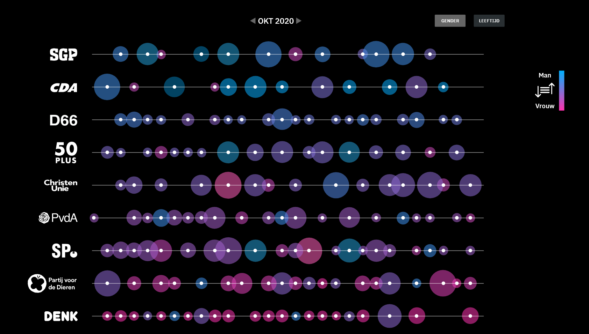

# datavisFTM

# frontend-applications

**functional-programming en frontend data 20/21**  
**Auteur:** _Simon Planje_  
[🔴 live gh-pages](https://simonplanje.github.io/datavisFTM/)

# Concept
  

### Geldsporen liegen niet
Van het bedrijf [Follow The Money](https://www.ftm.nl/) hebben wij de opdracht gekregen om een datavisualisatie te maken dat gaat over de uitgaven van van politieke partijen als het gaat om adverteren. Er is open data te vinden over deze uitgaven en Follow the Money wil de inzichten uit deze [dataset](https://raw.githubusercontent.com/SimonPlanje/datavisFTM/main/public/data/facebook.json) graag op hun website kunnen weergeven. 

## Onderzoeksvragen

> **Hoe kan de politieke op een overzichtlijke, interactieve manier worden weergegeven waardoor de gebruiker snel inzichten kan herkennen uit de data**

## Het concept

Het concept is een interactieve datastory die je door verschillende visualisaties heen leidt. Aan de hand van de visualisaties worden de features van het dashboard waar de datastory mee eindigd uitgelegd zodat deze meteen duidelijk zijn waneer de gebruiker bij het dashboard aankomt.

Na veel prototypes te hebben gemaakt hebben we ervoor gekozen om een "bubble instance chart" te gaan maken.
De Bubble Instance Chart focust zich vooral op de micro-targeting data van Gender en Leeftijd. Dit laat al snel stereotypes zien bij verschillende partijen, daarom is dit interessant om te laten zien.

De Bubble Instance Chart maakt het mogelijk om elk datapunt over tijd in te zien. Je krijgt eerst een overzicht per maand te zien, daarna kun je ervoor kiezen om je te verdiepen in één dag door op een bolletje te klikken. Je krijgt dan een detailscherm te zien. Op het detailscherm krijg je inzicht in de verhoudingen van gender -en leeftijd, hoeveel views de advertenties hebben, hoeveel geld er aan is uitgegeven en zie je door middel van screenshots om welke advertenties het gaat.


## Features

1. De gebruiker komt er achter welke doelgroep verschillende partijen focussen.

2. Als tweede komt het dashboard in beeld waar de gebruiker partijen met elkaar kan vergelijken:

    3. Filter op leeftijd of geslacht
    4. Meer informatie vergaren over de advertenties door er op het datapunt te klikken


## Datasets
1. [Facebook dataset advertenties](https://raw.githubusercontent.com/SimonPlanje/datavisFTM/main/public/data/facebook.json)
    - Age 
    - Gender 
    - Delivery start/stop 
    - Advertiser name 
    - Spend lower/upper 
    - Impression lower/upper 
    - ad_snapshot_url 

2. [Google dataset advertenties]()


# Clone dit project

1. Clone de repository in de terminal

```git
git clone https://github.com/SimonPlanje/datavisFTM.git
```

2. Open de bestanden in VScode
4. Open de terminal in het bestand waarin je de repo hebt gecloned
5. Gebruik in de terminal het script `npm install`
6. Gebruik als npm install klaar is het script `npm start`. Dit zal de applicatie automatisch openen op een localhost:3000
7. Nu start er een live versie van de applicatie op ENJOY!


## Bronnen

### Bronnen bij het maken van de visualisatie
- https://www.ftm.nl/artikelen/politieke-partijen-online-reclame
- https://www.d3-graph-gallery.com/graph/bubblemap_buttonControl.html
- http://bl.ocks.org/ZJONSSON/3918369
- https://stackoverflow.com/questions/47870887/how-to-fill-in-missing-keys-in-an-array-of-objects/47871014#47871014?newreg=7adc7a5e48b7436d99619b4aad68d8f8
- https://stackoverflow.com/questions/50023291/add-id-to-array-of-objects-javascript
- https://www.youtube.com/watch?v=BMUiFMZr7vk&t=554s
- https://curran.github.io/dataviz-course-2018/
- https://developer.mozilla.org/en-US/docs/Web/JavaScript/Reference/Operators/Spread_syntax  
  
  
  
*Project mede gevisualiseerd door:*
*Jesse Silva en Isis Polak*  
*MIT License*
